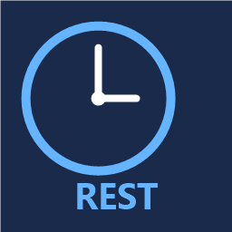
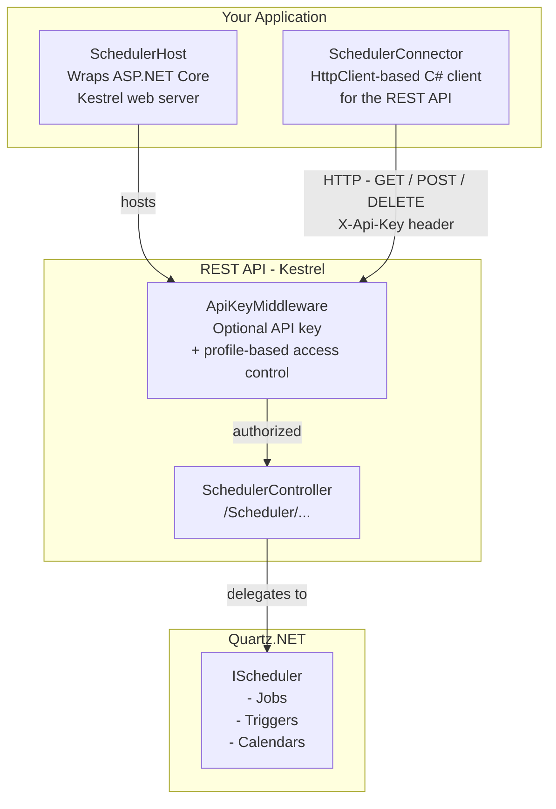

# QuartzRestApi

A self-hosted REST API library for [Quartz.NET](https://www.quartz-scheduler.net/), built on **.NET 10** with **ASP.NET Core / Kestrel**.

## NuGet

[](https://www.nuget.org/packages/QuartzRestApi)

## Documentation

[](https://sicos1977.github.io/QuartzRestApi)

Full API reference documentation (generated by [DocFX](https://dotnet.github.io/docfx/)) is published automatically to GitHub Pages on every push to `main`:

**https://sicos1977.github.io/QuartzRestApi**

---

## Architecture



**Key components:**

| Component | Description |
|---|---|
| `SchedulerHost` | Starts an ASP.NET Core / Kestrel HTTP server that exposes the Quartz.NET scheduler as a REST API |
| `ApiKeyMiddleware` | Optional middleware that validates the `X-Api-Key` header and enforces per-profile route restrictions |
| `ApiKeyProfile` | A named profile that pairs an API key with an optional whitelist of allowed endpoints |
| `SchedulerController` | ASP.NET Core controller with all scheduler endpoints under the `/Scheduler/` route prefix |
| `SchedulerConnector` | A typed C# HTTP client that wraps all REST calls so you do not need to craft HTTP requests manually |
| Wrappers | DTO classes (de)serialised to/from JSON for jobs, triggers, calendars, etc. |

---

## Requirements

- .NET 10 or higher
- A configured [Quartz.NET](https://www.quartz-scheduler.net/) `IScheduler`

---

## How to host Quartz.NET via the REST API

```csharp
// No authentication — all endpoints publicly accessible
var host = new SchedulerHost("http://localhost:44344", scheduler, logger);
host.Start();
```

- `scheduler` — your `IScheduler` instance from Quartz.NET
- `logger` — any `Microsoft.Extensions.Logging.ILogger` (or `null` to disable logging)

To stop the host:

```csharp
host.Stop();
```

---

## How to connect to the host

```csharp
var connector = new SchedulerConnector("http://localhost:44344");
```

Use the `SchedulerConnector` methods to call the API from C# without dealing with raw HTTP.

---

## Security (API key authentication)

Authentication is **opt-in**. When no key or profiles are configured every request passes through without any check.

### Single API key (full access)

The simplest option — one key that grants access to all endpoints:

```csharp
// Host
var host = new SchedulerHost("http://localhost:44344", scheduler, logger,
    apiKey: "my-secret-key");

// Client
var connector = new SchedulerConnector("http://localhost:44344",
    apiKey: "my-secret-key");
```

The key is sent and validated via the `X-Api-Key` HTTP header.

### Multiple API keys with profiles

Each `ApiKeyProfile` pairs an API key with a set of strongly-typed boolean properties -- one per endpoint.

Use `ApiKeyProfile.AllowAll` to start with full access and selectively disable endpoints, or use `ApiKeyProfile.DenyAll` to start with no access and selectively enable only what is needed.

```csharp
// Admin profile -- full access to all endpoints
var admin = ApiKeyProfile.AllowAll("Admin", "key-admin-abc123");

// Read-only profile -- start with nothing allowed, then enable only query endpoints
var readOnly = ApiKeyProfile.DenyAll("ReadOnly", "key-readonly-xyz");
readOnly.SchedulerName             = true;
readOnly.SchedulerInstanceId       = true;
readOnly.GetMetaData               = true;
readOnly.GetJobGroupNames          = true;
readOnly.GetTriggerGroupNames      = true;
readOnly.GetJobKeys                = true;
readOnly.GetJobDetail              = true;
readOnly.GetTrigger                = true;
readOnly.GetTriggerState           = true;
readOnly.GetCurrentlyExecutingJobs = true;

// Monitoring profile -- start with full access, then remove mutating endpoints
var monitoring = ApiKeyProfile.AllowAll("Monitoring", "key-mon-def456");
monitoring.Start                              = false;
monitoring.StartDelayed                       = false;
monitoring.Standby                            = false;
monitoring.Shutdown                           = false;
monitoring.Clear                              = false;
monitoring.ScheduleJobWithJobDetailAndTrigger  = false;
monitoring.ScheduleJobIdentifiedWithTrigger    = false;
monitoring.ScheduleJobWithJobDetailAndTriggers = false;
monitoring.ScheduleJobs                       = false;
monitoring.RescheduleJob                      = false;
monitoring.UnscheduleJob                      = false;
monitoring.UnscheduleJobs                     = false;
monitoring.AddJob                             = false;
monitoring.DeleteJob                          = false;
monitoring.DeleteJobs                         = false;
monitoring.TriggerJobWithJobkey               = false;
monitoring.TriggerJobWithDataMap              = false;
monitoring.PauseJob                           = false;
monitoring.PauseJobs                          = false;
monitoring.PauseTrigger                       = false;
monitoring.PauseTriggers                      = false;
monitoring.PauseAllTriggers                   = false;
monitoring.ResumeJob                          = false;
monitoring.ResumeJobs                         = false;
monitoring.ResumeTrigger                      = false;
monitoring.ResumeTriggers                     = false;
monitoring.ResumeAllTriggers                  = false;
monitoring.AddCalendar                        = false;
monitoring.DeleteCalendar                     = false;
monitoring.ResetTriggerFromErrorState         = false;

var host = new SchedulerHost("http://localhost:44344", scheduler, logger,
    profiles: [admin, readOnly, monitoring]);
```
#### Persisting profiles

Profiles can be saved to and loaded from JSON, making it easy to store them in a configuration file or database:

```csharp
// Save
File.WriteAllText("readOnly.json", readOnly.ToJson());

// Load
var loaded = ApiKeyProfile.FromJson(File.ReadAllText("readOnly.json"));
```

#### HTTP responses

| Situation | Status |
|---|---|
| No profiles configured | Request passes through (no auth) |
| `X-Api-Key` header missing | `401 Unauthorized` |
| Key not recognised | `401 Unauthorized` |
| Key valid, route allowed | Request passes through |
| Key valid, route not in whitelist | `403 Forbidden` |

---

## Interactive API documentation (Scalar / OpenAPI)

When the host is running, interactive API documentation is available at:

| URL | Description |
|---|---|
| `/openapi/v1.json` | Raw OpenAPI 3 document |
| `/scalar/v1` | [Scalar](https://scalar.com/) interactive API reference |

Open `http://localhost:44344/scalar/v1` in a browser to explore and test all endpoints without writing any code.

---

## Logging

QuartzRestApi uses the `Microsoft.Extensions.Logging.ILogger` interface. Any compatible logging library works (Serilog, NLog, etc.).

Log levels used:
- `Information` — standard results (booleans, names, DateTimeOffsets)
- `Debug` — full JSON request/response bodies
- `Warning` — rejected requests (missing or invalid API key, forbidden route)

---

## REST API Reference

The full REST API reference is available as an interactive [Scalar](https://scalar.com/) browser in the documentation site:

**[https://sicos1977.github.io/QuartzRestApi/api-reference.html](https://sicos1977.github.io/QuartzRestApi/api-reference.html)**

From there you can explore all 56+ endpoints, view request/response schemas and download the raw OpenAPI 3 document.

The OpenAPI specification is also generated automatically during every CI build by the `tools/ExportOpenApi` tool in this repository, which starts a minimal in-memory `SchedulerHost`, fetches `/openapi/v1.json` and writes it to `docs/openapi.json`.

---

## Error handling

All `SchedulerConnector` methods that communicate with the host throw a `SchedulerConnectorException` when the host returns a non-success HTTP status code (4xx / 5xx). This makes it easy to distinguish transport or server-side errors from other exceptions in your application.

```csharp
using QuartzRestApi.Exceptions;

try
{
    var fireTime = await connector.ScheduleJob(trigger);
}
catch (SchedulerConnectorException ex)
{
    // ex.Message contains the HTTP status code and the response body,
    // e.g. "The scheduler host returned HTTP 500 (Internal Server Error). Body: ..."
    logger.LogError(ex, "Failed to schedule job");
}
```

All public methods on `SchedulerConnector` document this exception via `<exception cref="SchedulerConnectorException">` in their XML documentation, so it surfaces as a tooltip in Visual Studio IntelliSense.

---

## License

QuartzRestApi is Copyright (C) 2022 - 2026 Magic-Sessions and is licensed under the MIT license:

    Permission is hereby granted, free of charge, to any person obtaining a copy
    of this software and associated documentation files (the "Software"), to deal
    in the Software without restriction, including without limitation the rights
    to use, copy, modify, merge, publish, distribute, sublicense, and/or sell
    copies of the Software, and to permit persons to whom the Software is
    furnished to do so, subject to the following conditions:

    The above copyright notice and this permission notice shall be included in
    all copies or substantial portions of the Software.

    THE SOFTWARE IS PROVIDED "AS IS", WITHOUT WARRANTY OF ANY KIND, EXPRESS OR
    IMPLIED, INCLUDING BUT NOT LIMITED TO THE WARRANTIES OF MERCHANTABILITY,
    FITNESS FOR A PARTICULAR PURPOSE AND NON INFRINGEMENT. IN NO EVENT SHALL THE
    AUTHORS OR COPYRIGHT HOLDERS BE LIABLE FOR ANY CLAIM, DAMAGES OR OTHER
    LIABILITY, WHETHER IN AN ACTION OF CONTRACT, TORT OR OTHERWISE, ARISING FROM,
    OUT OF OR IN CONNECTION WITH THE SOFTWARE OR THE USE OR OTHER DEALINGS IN
    THE SOFTWARE.


---

## Core Team

- [Sicos1977](https://github.com/Sicos1977) (Kees van Spelde)