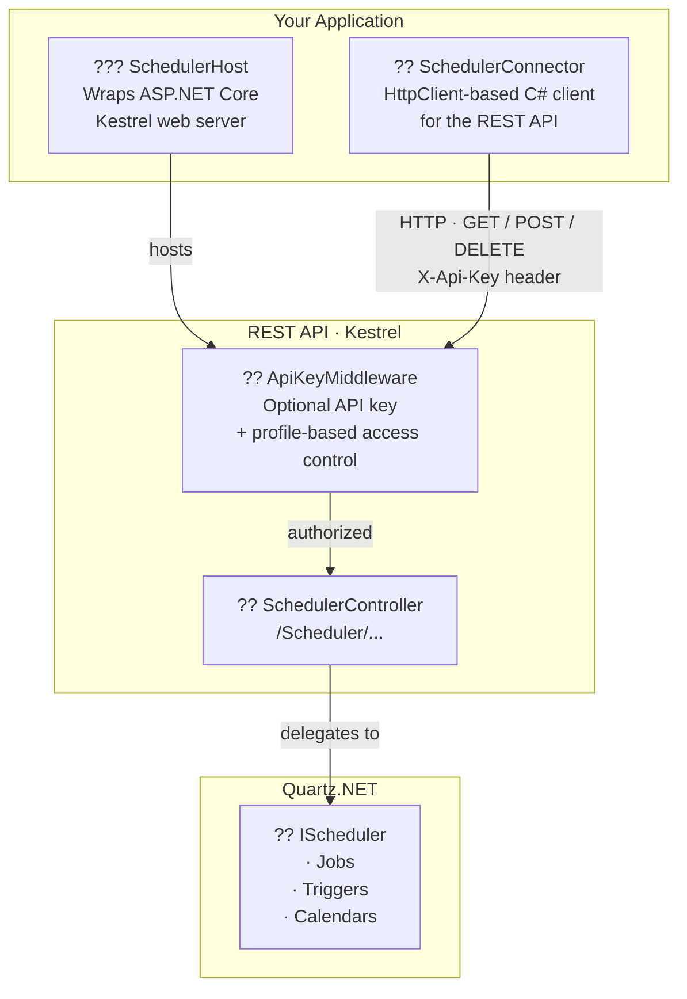
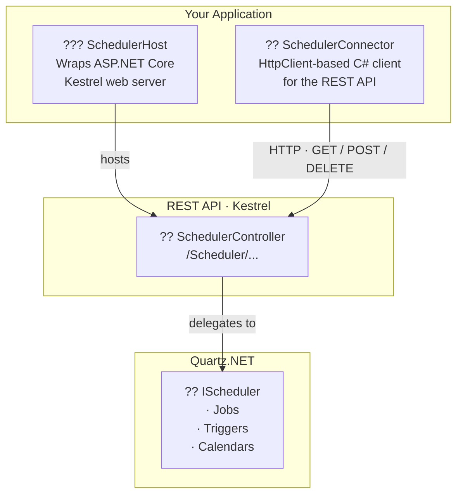

#TODO: Make all unit tests work

# QuartzRestApi

A self-hosted REST API library for [Quartz.NET](https://www.quartz-scheduler.net/), built on **.NET 10** with **ASP.NET Core / Kestrel**.

## NuGet

[](https://www.nuget.org/packages/QuartzRestApi)

## Documentation

[](https://sicos1977.github.io/QuartzRestApi)

Full API reference documentation (generated by [DocFX](https://dotnet.github.io/docfx/)) is published automatically to GitHub Pages on every push to `main`:

**https://sicos1977.github.io/QuartzRestApi**

---

## Architecture



**Key components:**

| Component | Description |
|---|---|
| `SchedulerHost` | Starts an ASP.NET Core / Kestrel HTTP server that exposes the Quartz.NET scheduler as a REST API |
| `ApiKeyMiddleware` | Optional middleware that validates the `X-Api-Key` header and enforces per-profile route restrictions |
| `ApiKeyProfile` | A named profile that pairs an API key with an optional whitelist of allowed endpoints |
| `SchedulerController` | ASP.NET Core controller with all scheduler endpoints under the `/Scheduler/` route prefix |
| `SchedulerConnector` | A typed C# HTTP client that wraps all REST calls so you do not need to craft HTTP requests manually |
| Wrappers | DTO classes (de)serialised to/from JSON for jobs, triggers, calendars, etc. |

---

## Requirements

- .NET 10 or higher
- A configured [Quartz.NET](https://www.quartz-scheduler.net/) `IScheduler`

---

## How to host Quartz.NET via the REST API

```csharp
// No authentication — all endpoints publicly accessible
var host = new SchedulerHost("http://localhost:44344", scheduler, logger);
host.Start();
```

- `scheduler` — your `IScheduler` instance from Quartz.NET
- `logger` — any `Microsoft.Extensions.Logging.ILogger` (or `null` to disable logging)

To stop the host:

```csharp
host.Stop();
```

---

## How to connect to the host

```csharp
var connector = new SchedulerConnector("http://localhost:44344");
```

Use the `SchedulerConnector` methods to call the API from C# without dealing with raw HTTP.

---

## Security (API key authentication)

Authentication is **opt-in**. When no key or profiles are configured every request passes through without any check.

### Single API key (full access)

The simplest option — one key that grants access to all endpoints:

```csharp
// Host
var host = new SchedulerHost("http://localhost:44344", scheduler, logger,
    apiKey: "my-secret-key");

// Client
var connector = new SchedulerConnector("http://localhost:44344",
    apiKey: "my-secret-key");
```

The key is sent and validated via the `X-Api-Key` HTTP header.

### Multiple API keys with profiles

Each `ApiKeyProfile` pairs an API key with a set of strongly-typed boolean properties -- one per endpoint.

Use `ApiKeyProfile.AllowAll` to start with full access and selectively disable endpoints, or use `ApiKeyProfile.DenyAll` to start with no access and selectively enable only what is needed.

```csharp
// Admin profile -- full access to all endpoints
var admin = ApiKeyProfile.AllowAll("Admin", "key-admin-abc123");

// Read-only profile -- start with nothing allowed, then enable only query endpoints
var readOnly = ApiKeyProfile.DenyAll("ReadOnly", "key-readonly-xyz");
readOnly.SchedulerName             = true;
readOnly.SchedulerInstanceId       = true;
readOnly.GetMetaData               = true;
readOnly.GetJobGroupNames          = true;
readOnly.GetTriggerGroupNames      = true;
readOnly.GetJobKeys                = true;
readOnly.GetJobDetail              = true;
readOnly.GetTrigger                = true;
readOnly.GetTriggerState           = true;
readOnly.GetCurrentlyExecutingJobs = true;

// Monitoring profile -- start with full access, then remove mutating endpoints
var monitoring = ApiKeyProfile.AllowAll("Monitoring", "key-mon-def456");
monitoring.Start                              = false;
monitoring.StartDelayed                       = false;
monitoring.Standby                            = false;
monitoring.Shutdown                           = false;
monitoring.Clear                              = false;
monitoring.ScheduleJobWithJobDetailAndTrigger  = false;
monitoring.ScheduleJobIdentifiedWithTrigger    = false;
monitoring.ScheduleJobWithJobDetailAndTriggers = false;
monitoring.ScheduleJobs                       = false;
monitoring.RescheduleJob                      = false;
monitoring.UnscheduleJob                      = false;
monitoring.UnscheduleJobs                     = false;
monitoring.AddJob                             = false;
monitoring.DeleteJob                          = false;
monitoring.DeleteJobs                         = false;
monitoring.TriggerJobWithJobkey               = false;
monitoring.TriggerJobWithDataMap              = false;
monitoring.PauseJob                           = false;
monitoring.PauseJobs                          = false;
monitoring.PauseTrigger                       = false;
monitoring.PauseTriggers                      = false;
monitoring.PauseAllTriggers                   = false;
monitoring.ResumeJob                          = false;
monitoring.ResumeJobs                         = false;
monitoring.ResumeTrigger                      = false;
monitoring.ResumeTriggers                     = false;
monitoring.ResumeAllTriggers                  = false;
monitoring.AddCalendar                        = false;
monitoring.DeleteCalendar                     = false;
monitoring.ResetTriggerFromErrorState         = false;

var host = new SchedulerHost("http://localhost:44344", scheduler, logger,
    profiles: [admin, readOnly, monitoring]);
```
#### Persisting profiles

Profiles can be saved to and loaded from JSON, making it easy to store them in a configuration file or database:

```csharp
// Save
File.WriteAllText("readOnly.json", readOnly.ToJson());

// Load
var loaded = ApiKeyProfile.FromJson(File.ReadAllText("readOnly.json"));
```

#### HTTP responses

| Situation | Status |
|---|---|
| No profiles configured | Request passes through (no auth) |
| `X-Api-Key` header missing | `401 Unauthorized` |
| Key not recognised | `401 Unauthorized` |
| Key valid, route allowed | Request passes through |
| Key valid, route not in whitelist | `403 Forbidden` |

---

## Interactive API documentation (Scalar / OpenAPI)

When the host is running, interactive API documentation is available at:

| URL | Description |
|---|---|
| `/openapi/v1.json` | Raw OpenAPI 3 document |
| `/scalar/v1` | [Scalar](https://scalar.com/) interactive API reference |

Open `http://localhost:44344/scalar/v1` in a browser to explore and test all endpoints without writing any code.

---

## Logging

QuartzRestApi uses the `Microsoft.Extensions.Logging.ILogger` interface. Any compatible logging library works (Serilog, NLog, etc.).

Log levels used:
- `Information` — standard results (booleans, names, DateTimeOffsets)
- `Debug` — full JSON request/response bodies
- `Warning` — rejected requests (missing or invalid API key, forbidden route)

---

## REST API Reference

All endpoints are prefixed with `/Scheduler/`.

---

### Scheduler status

| Method | Route | Description |
|--------|-------|-------------|
| `GET` | `Scheduler/SchedulerName` | Returns the scheduler name |
| `GET` | `Scheduler/SchedulerInstanceId` | Returns the scheduler instance id |
| `GET` | `Scheduler/SchedulerContext` | Returns the scheduler context as a key/value JSON object |
| `GET` | `Scheduler/GetMetaData` | Returns scheduler metadata |
| `GET` | `Scheduler/InStandbyMode` | Returns `true` if the scheduler is in standby mode |
| `GET` | `Scheduler/IsShutdown` | Returns `true` if the scheduler is shut down |
| `GET` | `Scheduler/IsStarted` | Returns `true` if the scheduler has been started |

#### Example — GetMetaData response

```json
{
    "InStandbyMode": false,
    "JobStoreType": "Quartz.Simpl.RAMJobStore, Quartz, Version=3.8.1.0",
    "JobStoreClustered": false,
    "JobsStoreSupportsPersistence": false,
    "NumbersOfJobsExecuted": 0,
    "RunningSince": "2026-01-28T11:00:00.0000000+00:00",
    "SchedulerInstanceId": "NON_CLUSTERED",
    "SchedulerName": "MyScheduler",
    "SchedulerRemote": false,
    "Shutdown": false,
    "Started": true,
    "ThreadPoolSize": 10,
    "Version": "3.8.1.0"
}
```

---

### Scheduler lifecycle

| Method | Route | Description |
|--------|-------|-------------|
| `POST` | `Scheduler/Start` | Starts the scheduler |
| `POST` | `Scheduler/StartDelayed/{delay}` | Starts the scheduler after `{delay}` seconds |
| `POST` | `Scheduler/Standby` | Puts the scheduler in standby mode |
| `POST` | `Scheduler/Shutdown` | Shuts down the scheduler |
| `POST` | `Scheduler/Shutdown/{waitForJobsToComplete}` | Shuts down the scheduler; pass `true` to wait for running jobs |
| `POST` | `Scheduler/Clear` | Deletes **all** jobs, triggers and calendars from the scheduler |

---

### Job groups

| Method | Route | Description |
|--------|-------|-------------|
| `GET` | `Scheduler/IsJobGroupPaused/{groupName}` | Returns `true` if the job group is paused |
| `GET` | `Scheduler/GetJobGroupNames` | Returns all job group names |

---

### Trigger groups

| Method | Route | Description |
|--------|-------|-------------|
| `GET` | `Scheduler/IsTriggerGroupPaused/{groupName}` | Returns `true` if the trigger group is paused |
| `GET` | `Scheduler/GetTriggerGroupNames` | Returns all trigger group names |
| `GET` | `Scheduler/GetPausedTriggerGroups` | Returns all paused trigger group names |

---

### Scheduling jobs

#### Schedule a job with a job detail and a single trigger

`POST Scheduler/ScheduleJobWithJobDetailAndTrigger`

```json
{
  "JobDetail": {
    "JobKey": { "Name": "MyJob", "Group": "MyGroup" },
    "Description": "My job description",
    "JobType": "MyNamespace.MyJob",
    "JobDataMap": { "key": "value" },
    "Durable": true,
    "Replace": false,
    "StoreNonDurableWhileAwaitingScheduling": false
  },
  "Trigger": {
    "TriggerKey": { "Name": "MyTrigger", "Group": "MyGroup" },
    "Description": "My trigger description",
    "StartTimeUtc": "2026-01-28T12:00:00+00:00",
    "CronSchedule": "0 * * ? * *",
    "Priority": 5,
    "JobKey": { "Name": "MyJob", "Group": "MyGroup" }
  }
}
```

> If you get `Could not find an IJob class with the type '...'`, make sure `JobType` is the fully-qualified type name.

Returns the `DateTimeOffset` of the first scheduled fire time.

#### Schedule a job with a job detail and multiple triggers

`POST Scheduler/ScheduleJobWithJobDetailAndTriggers`

```json
{
  "JobDetail": {
    "JobKey": { "Name": "MyJob", "Group": "MyGroup" },
    "JobType": "MyNamespace.MyJob",
    "Durable": true,
    "Replace": false,
    "StoreNonDurableWhileAwaitingScheduling": false
  },
  "Triggers": [
    {
      "TriggerKey": { "Name": "MyTrigger1", "Group": "MyGroup" },
      "CronSchedule": "0 * * ? * *",
      "Priority": 5,
      "JobKey": { "Name": "MyJob", "Group": "MyGroup" }
    },
    {
      "TriggerKey": { "Name": "MyTrigger2", "Group": "MyGroup" },
      "CronSchedule": "0 30 * ? * *",
      "Priority": 5,
      "JobKey": { "Name": "MyJob", "Group": "MyGroup" }
    }
  ],
  "Replace": false
}
```

#### Schedule the trigger with the job identified by the trigger

`POST Scheduler/ScheduleJobIdentifiedWithTrigger`

```json
{
    "TriggerKey": { "Name": "MyTrigger", "Group": "MyGroup" },
    "JobKey": { "Name": "MyJob", "Group": "MyGroup" },
    "CronSchedule": "0 * * ? * *",
    "Priority": 5
}
```

#### Schedule multiple jobs at once

`POST Scheduler/ScheduleJobs`

```json
{
  "Jobs": [
    {
      "JobDetail": {
        "JobKey": { "Name": "Job1", "Group": "MyGroup" },
        "JobType": "MyNamespace.MyJob",
        "Durable": true,
        "Replace": false,
        "StoreNonDurableWhileAwaitingScheduling": false
      },
      "Triggers": [
        {
          "TriggerKey": { "Name": "Trigger1", "Group": "MyGroup" },
          "CronSchedule": "0 * * ? * *",
          "Priority": 5,
          "JobKey": { "Name": "Job1", "Group": "MyGroup" }
        }
      ],
      "Replace": false
    }
  ],
  "Replace": false
}
```

---

### Rescheduling jobs

`POST Scheduler/RescheduleJob`

```json
{
    "CurrentTriggerKey": { "Name": "OldTrigger", "Group": "MyGroup" },
    "NewTrigger": {
        "TriggerKey": { "Name": "NewTrigger", "Group": "MyGroup" },
        "JobKey": { "Name": "MyJob", "Group": "MyGroup" },
        "CronSchedule": "0 * * ? * *",
        "Priority": 5
    }
}
```

Returns `null` if the current trigger was not found, otherwise the first fire time of the new trigger.

---

### Unscheduling jobs

#### Unschedule a single job

`POST Scheduler/UnscheduleJob`

```json
{ "Name": "MyTrigger", "Group": "MyGroup" }
```

Returns `true` when successfully unscheduled.

#### Unschedule multiple jobs

`POST Scheduler/UnscheduleJobs`

```json
[
    { "Name": "Trigger1", "Group": "Group1" },
    { "Name": "Trigger2", "Group": "Group2" }
]
```

Returns `true` when all were successfully unscheduled.

---

### Adding / deleting jobs

#### Add a job (no trigger)

`POST Scheduler/AddJob`

```json
{
    "JobKey": { "Name": "MyJob", "Group": "MyGroup" },
    "Description": "Description",
    "JobType": "MyNamespace.MyJob",
    "JobDataMap": { "Key1": "Value1" },
    "Durable": true,
    "Replace": false,
    "StoreNonDurableWhileAwaitingScheduling": true
}
```

#### Delete a job

`DELETE Scheduler/DeleteJob`

```json
{ "Name": "MyJob", "Group": "MyGroup" }
```

Returns `true` when deleted.

#### Delete multiple jobs

`DELETE Scheduler/DeleteJobs`

```json
[
    { "Name": "Job1", "Group": "Group1" },
    { "Name": "Job2", "Group": "Group2" }
]
```

Returns `true` when all were deleted.

---

### Triggering jobs manually

#### Trigger a job immediately

`POST Scheduler/TriggerJobWithJobkey`

```json
{ "Name": "MyJob", "Group": "MyGroup" }
```

#### Trigger a job immediately with a JobDataMap

`POST Scheduler/TriggerJobWithDataMap`

```json
{
    "JobKey": { "Name": "MyJob", "Group": "MyGroup" },
    "JobDataMap": { "Key1": "Value1" }
}
```

---

### Pausing and resuming

The `Type` field in group matchers can be: `Contains`, `EndsWith`, `Equals` or `StartsWith`.

| Method | Route | Body | Description |
|--------|-------|------|-------------|
| `POST` | `Scheduler/PauseJob` | `{ "Name": "...", "Group": "..." }` | Pause a single job |
| `POST` | `Scheduler/PauseJobs` | `{ "Type": "Equals", "Value": "..." }` | Pause jobs matching group matcher |
| `POST` | `Scheduler/PauseTrigger` | `{ "Name": "...", "Group": "..." }` | Pause a single trigger |
| `POST` | `Scheduler/PauseTriggers` | `{ "Type": "Equals", "Value": "..." }` | Pause triggers matching group matcher |
| `POST` | `Scheduler/PauseAllTriggers` | — | Pause all triggers |
| `POST` | `Scheduler/ResumeJob` | `{ "Name": "...", "Group": "..." }` | Resume a single job |
| `POST` | `Scheduler/ResumeJobs` | `{ "Type": "Equals", "Value": "..." }` | Resume jobs matching group matcher |
| `POST` | `Scheduler/ResumeTrigger` | `{ "Name": "...", "Group": "..." }` | Resume a single trigger |
| `POST` | `Scheduler/ResumeTriggers` | `{ "Type": "Equals", "Value": "..." }` | Resume triggers matching group matcher |
| `POST` | `Scheduler/ResumeAllTriggers` | — | Resume all triggers |

---

### Querying jobs and triggers

#### Get currently executing jobs

`GET Scheduler/GetCurrentlyExecutingJobs`

Returns an array of currently executing job execution context objects.

#### Get job group names

`GET Scheduler/GetJobGroupNames` ? `["Group1", "Group2"]`

#### Get trigger group names

`GET Scheduler/GetTriggerGroupNames` ? `["Group1", "Group2"]`

#### Get paused trigger groups

`GET Scheduler/GetPausedTriggerGroups` ? `["PausedGroup1"]`

#### Get job keys

`GET Scheduler/GetJobKeys` with body `{ "Type": "Equals", "Value": "MyGroup" }`

```json
[{ "Name": "MyJob", "Group": "MyGroup" }]
```

#### Get trigger keys

`GET Scheduler/GetTriggerKeys` with body `{ "Type": "Equals", "Value": "MyGroup" }`

```json
[{ "Name": "MyTrigger", "Group": "MyGroup" }]
```

#### Get job detail

`GET Scheduler/GetJobDetail` with body `{ "Name": "MyJob", "Group": "MyGroup" }`

```json
{
  "JobKey": { "Name": "MyJob", "Group": "MyGroup" },
  "Description": "My description",
  "JobType": "MyNamespace.MyJob",
  "JobDataMap": {},
  "Durable": false,
  "Replace": false,
  "StoreNonDurableWhileAwaitingScheduling": false
}
```

#### Get triggers of a job

`GET Scheduler/GetTriggersOfJob` with body `{ "Name": "MyJob", "Group": "MyGroup" }`

Returns an array of trigger objects.

#### Get a specific trigger

`GET Scheduler/GetTrigger` with body `{ "Name": "MyTrigger", "Group": "MyGroup" }`

```json
{
  "TriggerKey": { "Name": "MyTrigger", "Group": "MyGroup" },
  "Description": "My trigger",
  "CronSchedule": "0 * * ? * *",
  "NextFireTimeUtc": "2026-01-28T13:00:00+00:00",
  "StartTimeUtc": "2026-01-28T12:00:00+00:00",
  "Priority": 5,
  "HasMillisecondPrecision": false
}
```

#### Get trigger state

`GET Scheduler/GetTriggerState` with body `{ "Name": "MyTrigger", "Group": "MyGroup" }`

Returns one of: `Normal`, `Paused`, `Complete`, `Blocked`, `Error`, `None`.

---

### Checking existence

| Method | Route | Body | Returns |
|--------|-------|------|---------|
| `GET` | `Scheduler/checkexistsjobkey` | `{ "Name": "...", "Group": "..." }` | `true` / `false` |
| `GET` | `Scheduler/checkexiststriggerkey` | `{ "Name": "...", "Group": "..." }` | `true` / `false` |

---

### Interrupting jobs

#### Interrupt all running instances of a job

`GET Scheduler/InterruptJobKey` with body `{ "Name": "MyJob", "Group": "MyGroup" }`

Returns `true` if at least one instance was interrupted.

#### Interrupt a specific running instance by fire instance id

`GET Scheduler/interruptfireinstanceid/{fireInstanceId}`

Returns `true` if the instance was found and interrupted.

---

### Error state

#### Reset a trigger from error state

`POST Scheduler/ResetTriggerFromErrorState`

```json
{ "Name": "MyTrigger", "Group": "MyGroup" }
```

Resets a trigger in `Error` state back to `Normal` or `Paused`. Has no effect when the trigger is not in error state.

---

### Calendars

#### Add a calendar

`POST Scheduler/AddCalendar`

Supported calendar types: `Annual`, `Cron`, `Daily`, `Holiday`, `Monthly`, `Weekly`

Example (Cron calendar):

```json
{
  "Name": "MyCronCalendar",
  "Type": "Cron",
  "CronExpression": "0 0-5 14 * * ?",
  "Description": "Exclude 14:00–14:05 every day",
  "Replace": true,
  "UpdateTriggers": true
}
```

#### Delete a calendar

`DELETE Scheduler/DeleteCalendar/{calName}`

Returns `true` or `false`.

#### Get a calendar

`GET Scheduler/GetCalendar/{calName}`

Returns the calendar object (structure depends on calendar type).

#### Get calendar names

`GET Scheduler/GetCalendarNames` ? `["Calendar1", "Calendar2"]`

---

### Error responses

When an error occurs the API returns a JSON-serialised .NET exception:

```json
{
    "Message": "An error has occurred.",
    "ExceptionMessage": "Unable to store Trigger: 'MyGroup.MyTrigger', because one already exists with this identification.",
    "ExceptionType": "Quartz.ObjectAlreadyExistsException",
    "StackTrace": "... the .NET stack trace ..."
}
```

---

## License

QuartzRestApi is Copyright (C) 2022 - 2026 Magic-Sessions and is licensed under the MIT license:

    Permission is hereby granted, free of charge, to any person obtaining a copy
    of this software and associated documentation files (the "Software"), to deal
    in the Software without restriction, including without limitation the rights
    to use, copy, modify, merge, publish, distribute, sublicense, and/or sell
    copies of the Software, and to permit persons to whom the Software is
    furnished to do so, subject to the following conditions:

    The above copyright notice and this permission notice shall be included in
    all copies or substantial portions of the Software.

    THE SOFTWARE IS PROVIDED "AS IS", WITHOUT WARRANTY OF ANY KIND, EXPRESS OR
    IMPLIED, INCLUDING BUT NOT LIMITED TO THE WARRANTIES OF MERCHANTABILITY,
    FITNESS FOR A PARTICULAR PURPOSE AND NON INFRINGEMENT. IN NO EVENT SHALL THE
    AUTHORS OR COPYRIGHT HOLDERS BE LIABLE FOR ANY CLAIM, DAMAGES OR OTHER
    LIABILITY, WHETHER IN AN ACTION OF CONTRACT, TORT OR OTHERWISE, ARISING FROM,
    OUT OF OR IN CONNECTION WITH THE SOFTWARE OR THE USE OR OTHER DEALINGS IN
    THE SOFTWARE.


A self-hosted REST API library for [Quartz.NET](https://www.quartz-scheduler.net/), built on **.NET 10** with **ASP.NET Core / Kestrel**.

## NuGet

[](https://www.nuget.org/packages/QuartzRestApi)

## Documentation

[](https://sicos1977.github.io/QuartzRestApi)

Full API reference documentation (generated by [DocFX](https://dotnet.github.io/docfx/)) is published automatically to GitHub Pages on every push to `main`:

**https://sicos1977.github.io/QuartzRestApi**

---

## Architecture



**Key components:**

| Component | Description |
|---|---|
| `SchedulerHost` | Starts an ASP.NET Core / Kestrel HTTP server that exposes the Quartz.NET scheduler as a REST API |
| `SchedulerController` | ASP.NET Core controller with all scheduler endpoints under the `/Scheduler/` route prefix |
| `SchedulerConnector` | A typed C# HTTP client that wraps all REST calls so you do not need to craft HTTP requests manually |
| Wrappers | DTO classes (de)serialised to/from JSON for jobs, triggers, calendars, etc. |

---

## Requirements

- .NET 10 or higher
- A configured [Quartz.NET](https://www.quartz-scheduler.net/) `IScheduler`

---

## How to host Quartz.NET via the REST API

```csharp
var host = new SchedulerHost("http://localhost:44344", scheduler, logger);
host.Start();
```

- `scheduler` - your `IScheduler` instance from Quartz.NET
- `logger` - any `Microsoft.Extensions.Logging.ILogger` (or `null` to disable logging)

To stop the host:

```csharp
host.Stop();
```

---

## How to connect to the host

```csharp
var connector = new SchedulerConnector("http://localhost:44344");
```

Use the `SchedulerConnector` methods to call the API from C# without dealing with raw HTTP.

---

## Logging

QuartzRestApi uses the `Microsoft.Extensions.Logging.ILogger` interface. Any compatible logging library works (Serilog, NLog, etc.).

Built-in loggers are available in the `QuartzRestApi.Loggers` namespace:

```csharp
// Log to console
ILogger logger = new QuartzRestApi.Loggers.Console();

// Log to a file
ILogger logger = new QuartzRestApi.Loggers.Stream(File.OpenWrite("quartz.log"));
```

Log levels used:
- `Information` - standard results (booleans, names, DateTimeOffsets)
- `Debug` - full JSON request/response bodies

---

## REST API Reference

All endpoints are prefixed with `/Scheduler/`.

---

### Scheduler status

| Method | Route | Description |
|--------|-------|-------------|
| `GET` | `Scheduler/SchedulerName` | Returns the scheduler name |
| `GET` | `Scheduler/SchedulerInstanceId` | Returns the scheduler instance id |
| `GET` | `Scheduler/SchedulerContext` | Returns the scheduler context as a key/value JSON object |
| `GET` | `Scheduler/GetMetaData` | Returns scheduler metadata |
| `GET` | `Scheduler/InStandbyMode` | Returns `true` if the scheduler is in standby mode |
| `GET` | `Scheduler/IsShutdown` | Returns `true` if the scheduler is shut down |
| `GET` | `Scheduler/IsStarted` | Returns `true` if the scheduler is started |

#### Example - GetMetaData response

```json
{
    "InStandbyMode": false,
    "JobStoreType": "Quartz.Simpl.RAMJobStore, Quartz, Version=3.8.1.0, Culture=neutral, PublicKeyToken=f6b8c98a402cc8a4",
    "JobStoreClustered": false,
    "JobsStoreSupportsPersistence": false,
    "NumbersOfJobsExecuted": 0,
    "RunningSince": "2024-01-28T11:00:00.0000000+00:00",
    "SchedulerInstanceId": "NON_CLUSTERED",
    "SchedulerName": "MyScheduler",
    "SchedulerRemote": false,
    "SchedulerType": "Quartz.Impl.StdScheduler, Quartz, Version=3.8.1.0, Culture=neutral, PublicKeyToken=f6b8c98a402cc8a4",
    "Shutdown": false,
    "Started": true,
    "ThreadPoolSize": 10,
    "ThreadPoolType": "Quartz.Simpl.DefaultThreadPool, Quartz, Version=3.8.1.0, Culture=neutral, PublicKeyToken=f6b8c98a402cc8a4",
    "Version": "3.8.1.0"
}
```

---

### Scheduler lifecycle

| Method | Route | Description |
|--------|-------|-------------|
| `POST` | `Scheduler/Start` | Starts the scheduler |
| `POST` | `Scheduler/StartDelayed/{delay}` | Starts the scheduler after `{delay}` seconds |
| `POST` | `Scheduler/Standby` | Puts the scheduler in standby mode |
| `POST` | `Scheduler/Shutdown` | Shuts down the scheduler |
| `POST` | `Scheduler/Shutdown/{waitForJobsToComplete}` | Shuts down the scheduler; pass `true` to wait for running jobs to complete |

---

### Job groups

| Method | Route | Description |
|--------|-------|-------------|
| `GET` | `Scheduler/IsJobGroupPaused/{groupName}` | Returns `true` if the job group is paused |
| `GET` | `Scheduler/GetJobGroupNames` | Returns all job group names |

---

### Trigger groups

| Method | Route | Description |
|--------|-------|-------------|
| `GET` | `Scheduler/IsTriggerGroupPaused/{groupName}` | Returns `true` if the trigger group is paused |
| `GET` | `Scheduler/GetTriggerGroupNames` | Returns all trigger group names |
| `GET` | `Scheduler/GetPausedTriggerGroups` | Returns all paused trigger group names |

---

### Scheduling jobs

#### Schedule a job with a job detail and a trigger

`POST Scheduler/ScheduleJobWithJobDetailAndTrigger`

```json
{
  "JobDetail": {
    "JobKey": { "Name": "MyJob", "Group": "MyGroup" },
    "Description": "My job description",
    "JobType": "MyNamespace.MyJob",
    "JobDataMap": { "key": "value" },
    "Durable": true,
    "Replace": false,
    "StoreNonDurableWhileAwaitingScheduling": false
  },
  "Trigger": {
    "TriggerKey": { "Name": "MyTrigger", "Group": "MyGroup" },
    "Description": "My trigger description",
    "StartTimeUtc": "2024-01-28T12:00:00+00:00",
    "EndTimeUtc": null,
    "CronSchedule": "0 * * ? * *",
    "Priority": 5,
    "JobKey": { "Name": "MyJob", "Group": "MyGroup" },
    "JobDataMap": { "key": "value" }
  }
}
```

> If you get `Could not find an IJob class with the type '...'`, make sure `JobType` includes the full namespace.

#### Schedule a job with a job detail and multiple triggers

`POST Scheduler/ScheduleJobWithJobDetailAndTriggers`

```json
{
  "JobDetail": {
    "JobKey": { "Name": "MyJob", "Group": "MyGroup" },
    "Description": "description",
    "JobType": "MyNamespace.MyJob",
    "JobDataMap": { "key": "value" },
    "Durable": true,
    "Replace": false,
    "StoreNonDurableWhileAwaitingScheduling": false
  },
  "Triggers": [
    {
      "TriggerKey": { "Name": "MyTrigger", "Group": "MyGroup" },
      "Description": "description",
      "CalendarName": null,
      "CronSchedule": "0 * * ? * *",
      "Priority": 5,
      "JobKey": { "Name": "MyJob", "Group": "MyGroup" },
      "JobDataMap": { "key": "value" }
    }
  ],
  "Replace": false
}
```

#### Schedule the trigger with the job identified by the trigger

`POST Scheduler/ScheduleJobIdentifiedWithTrigger`

```json
{
    "TriggerKey": { "Name": "MyTrigger", "Group": "MyGroup" },
    "JobKey": { "Name": "MyJob", "Group": "MyGroup" },
    "Description": "Description",
    "CalendarName": null,
    "JobDataMap": { "Key1": "Value1" },
    "StartTimeUtc": "2024-01-28T12:00:00+00:00",
    "EndTimeUtc": null,
    "FinalFireTimeUtc": null,
    "CronSchedule": "0 * * ? * *",
    "Priority": 5
}
```

Returns the `DateTimeOffset` of the first scheduled fire time, e.g. `"2024-01-28T12:01:00+00:00"`.

---

### Rescheduling jobs

#### Reschedule a job

`POST Scheduler/RescheduleJob`

```json
{
    "CurrentTriggerKey": { "Name": "CurrentTrigger", "Group": "MyGroup" },
    "NewTrigger": {
        "TriggerKey": { "Name": "NewTrigger", "Group": "MyGroup" },
        "JobKey": { "Name": "MyJob", "Group": "MyGroup" },
        "Description": "Description",
        "CalendarName": null,
        "JobDataMap": { "Key1": "Value1" },
        "StartTimeUtc": "2024-01-28T12:00:00+00:00",
        "EndTimeUtc": null,
        "FinalFireTimeUtc": null,
        "CronSchedule": "0 * * ? * *",
        "Priority": 5
    }
}
```

Returns `null` if the current trigger was not found, otherwise the first fire time of the new trigger.

---

### Unscheduling jobs

#### Unschedule a job

`POST Scheduler/UnscheduleJob`

```json
{ "Name": "MyTrigger", "Group": "MyGroup" }
```

Returns `true` when successfully unscheduled.

#### Unschedule multiple jobs

`POST Scheduler/UnscheduleJobs`

```json
[
    { "Name": "Trigger1", "Group": "Group1" },
    { "Name": "Trigger2", "Group": "Group2" }
]
```

Returns `true` when successfully unscheduled.

---

### Adding / deleting jobs

#### Add a job (no trigger)

`POST Scheduler/AddJob`

```json
{
    "JobKey": { "Name": "MyJob", "Group": "MyGroup" },
    "Description": "Description",
    "JobType": "MyNamespace.MyJob",
    "JobDataMap": { "Key1": "Value1" },
    "Durable": true,
    "Replace": false,
    "StoreNonDurableWhileAwaitingScheduling": true
}
```

#### Delete a job

`POST Scheduler/DeleteJob`

```json
{ "Name": "MyJob", "Group": "MyGroup" }
```

Returns `true` when deleted.

#### Delete multiple jobs

`DELETE Scheduler/DeleteJobs`

```json
[
    { "Name": "Job1", "Group": "Group1" },
    { "Name": "Job2", "Group": "Group2" }
]
```

---

### Triggering jobs manually

#### Trigger a job immediately

`POST Scheduler/TriggerJobWithJobkey`

```json
{ "Name": "MyJob", "Group": "MyGroup" }
```

#### Trigger a job immediately with a JobDataMap

`POST Scheduler/TriggerJobWithDataMap`

```json
{
    "JobKey": { "Name": "MyJob", "Group": "MyGroup" },
    "JobDataMap": { "Key1": "Value1" }
}
```

---

### Pausing and resuming

The `Type` field in group matchers can be: `Contains`, `EndsWith`, `Equals` or `StartsWith`.

| Method | Route | Body | Description |
|--------|-------|------|-------------|
| `POST` | `Scheduler/PauseJob` | `{ "Name": "...", "Group": "..." }` | Pause a single job |
| `POST` | `Scheduler/PauseJobs` | `{ "Type": "Contains", "Value": "..." }` | Pause jobs matching group matcher |
| `POST` | `Scheduler/PauseTrigger` | `{ "Name": "...", "Group": "..." }` | Pause a single trigger |
| `POST` | `Scheduler/PauseTriggers` | `{ "Type": "Contains", "Value": "..." }` | Pause triggers matching group matcher |
| `POST` | `Scheduler/PauseAllTriggers` | - | Pause all triggers |
| `POST` | `Scheduler/ResumeJob` | `{ "Name": "...", "Group": "..." }` | Resume a single job |
| `POST` | `Scheduler/ResumeJobs` | `{ "Type": "Contains", "Value": "..." }` | Resume jobs matching group matcher |
| `POST` | `Scheduler/ResumeTrigger` | `{ "Name": "...", "Group": "..." }` | Resume a single trigger |
| `POST` | `Scheduler/ResumeTriggers` | `{ "Type": "Contains", "Value": "..." }` | Resume triggers matching group matcher |
| `POST` | `Scheduler/ResumeAllTriggers` | - | Resume all triggers |

---

### Querying jobs and triggers

#### Get currently executing jobs

`GET Scheduler/GetCurrentlyExecutingJobs`

Returns an array of currently executing job context objects.

#### Get job group names

`GET Scheduler/GetJobGroupNames`

```json
["Group1", "Group2"]
```

#### Get trigger group names

`GET Scheduler/GetTriggerGroupNames`

```json
["Group1", "Group2"]
```

#### Get paused trigger groups

`GET Scheduler/GetPausedTriggerGroups`

```json
["PausedGroup1"]
```

#### Get job keys

`GET Scheduler/GetJobKeys` with body:

```json
{ "Type": "Contains", "Value": "MyGroup" }
```

Returns:

```json
[{ "Name": "MyJob", "Group": "MyGroup" }]
```

#### Get trigger keys

`GET Scheduler/GetTriggerKeys` with body:

```json
{ "Type": "Contains", "Value": "MyGroup" }
```

Returns:

```json
[{ "Name": "MyTrigger", "Group": "MyGroup" }]
```

#### Get job detail

`GET Scheduler/GetJobDetail` with body:

```json
{ "Name": "MyJob", "Group": "MyGroup" }
```

Returns:

```json
{
  "JobKey": { "Name": "MyJob", "Group": "MyGroup" },
  "Description": "My description",
  "JobType": "MyNamespace.MyJob",
  "JobDataMap": {},
  "Durable": false,
  "Replace": false,
  "StoreNonDurableWhileAwaitingScheduling": false
}
```

#### Get triggers of a job

`GET Scheduler/GetTriggersOfJob` with body:

```json
{ "Name": "MyJob", "Group": "MyGroup" }
```

Returns an array of trigger objects.

#### Get a specific trigger

`GET Scheduler/GetTrigger` with body:

```json
{ "Name": "MyTrigger", "Group": "MyGroup" }
```

Returns:

```json
{
  "TriggerKey": { "Name": "MyTrigger", "Group": "DEFAULT" },
  "Description": "My trigger",
  "CalendarName": null,
  "CronSchedule": null,
  "NextFireTimeUtc": null,
  "PreviousFireTimeUtc": "2024-01-28T14:09:21.9475007+01:00",
  "StartTimeUtc": "2024-01-28T14:09:21.9475007+01:00",
  "EndTimeUtc": null,
  "FinalFireTimeUtc": "2024-01-28T14:09:21.9475007+01:00",
  "Priority": 5,
  "HasMillisecondPrecision": true,
  "JobKey": null,
  "JobDataMap": null
}
```

#### Get trigger state

`GET Scheduler/GetTriggerState` with body:

```json
{ "Name": "MyTrigger", "Group": "MyGroup" }
```

Returns e.g. `"Normal"`.

---

### Calendars

#### Add a calendar
 
`POST Scheduler/AddCalendar`

Supported calendar types: `Annual`, `Cron`, `Daily`, `Holiday`, `Monthly`, `Weekly`

Example (Cron calendar):

```json
{
  "Name": "MyCronCalendar",
  "Type": "Cron",
  "CronExpression": "0 0-5 14 * * ?",
  "Description": "My description",
  "Replace": true,
  "UpdateTriggers": true
}
```

#### Delete a calendar

`DELETE Scheduler/DeleteCalendar/{calName}`

Returns `true` or `false`.

#### Get a calendar

`GET Scheduler/GetCalendar/{calName}`

Returns the calendar object (structure depends on calendar type).

#### Get calendar names

`GET Scheduler/GetCalendarNames`

```json
["MyCalendar1", "MyCalendar2"]
```

---

### Error responses

When an error occurs the API returns a JSON-serialised .NET exception:

```json
{
    "Message": "An error has occurred.",
    "ExceptionMessage": "Unable to store Trigger: 'MyGroup.MyTrigger', because one already exists with this identification.",
    "ExceptionType": "Quartz.ObjectAlreadyExistsException",
    "StackTrace": "... the .NET stack trace ..."
}
```

---

## License

QuartzRestApi is Copyright (C) 2022 - 2026 Magic-Sessions and is licensed under the MIT license:

    Permission is hereby granted, free of charge, to any person obtaining a copy
    of this software and associated documentation files (the "Software"), to deal
    in the Software without restriction, including without limitation the rights
    to use, copy, modify, merge, publish, distribute, sublicense, and/or sell
    copies of the Software, and to permit persons to whom the Software is
    furnished to do so, subject to the following conditions:

    The above copyright notice and this permission notice shall be included in
    all copies or substantial portions of the Software.

    THE SOFTWARE IS PROVIDED "AS IS", WITHOUT WARRANTY OF ANY KIND, EXPRESS OR
    IMPLIED, INCLUDING BUT NOT LIMITED TO THE WARRANTIES OF MERCHANTABILITY,
    FITNESS FOR A PARTICULAR PURPOSE AND NONINFRINGEMENT. IN NO EVENT SHALL THE
    AUTHORS OR COPYRIGHT HOLDERS BE LIABLE FOR ANY CLAIM, DAMAGES OR OTHER
    LIABILITY, WHETHER IN AN ACTION OF CONTRACT, TORT OR OTHERWISE, ARISING FROM,
    OUT OF OR IN CONNECTION WITH THE SOFTWARE OR THE USE OR OTHER DEALINGS IN
    THE SOFTWARE.

---

## Core Team

- [Sicos1977](https://github.com/Sicos1977) (Kees van Spelde)
