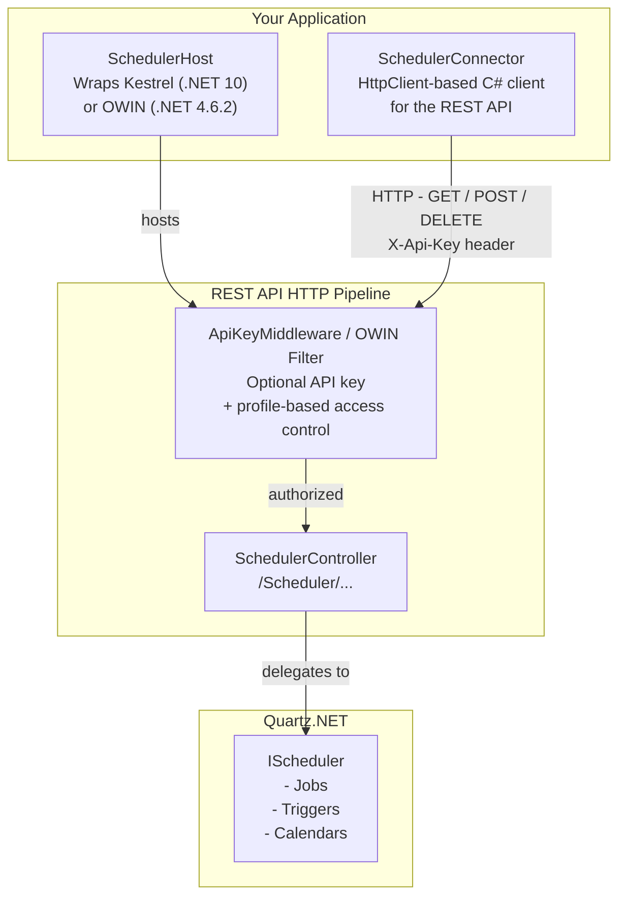

---
_layout: landing
---

# QuartzRestApi

A self-hosted REST API library for [Quartz.NET](https://www.quartz-scheduler.net/). This package is multi-targeted and provides native support for both modern and legacy frameworks:
* **.NET 10** built on **ASP.NET Core / Kestrel**
* **.NET Framework 4.6.2** self-hosted via **OWIN / Web API 2**

QuartzRestApi wraps your existing `IScheduler` instance behind an HTTP endpoint so other processes — on the same machine or across a network — can manage jobs and triggers without needing a direct Quartz.NET reference.

[](https://www.nuget.org/packages/QuartzRestApi)

---

## Architecture



**Key components:**


| Component | Description |
|---|---|
| `SchedulerHost` | Starts the HTTP server (.NET 10 Kestrel or .NET 4.6.2 OWIN) that exposes the Quartz.NET scheduler as a REST API |
| `ApiKeyMiddleware` | Optional middleware that validates the `X-Api-Key` header and enforces per-profile route restrictions |
| `ApiKeyProfile` | A named profile that pairs an API key with an optional whitelist of allowed endpoints |
| `SchedulerController` | API controller with all scheduler endpoints under the `/Scheduler/` route prefix |
| `SchedulerConnector` | A typed C# HTTP client that wraps all REST calls so you do not need to craft HTTP requests manually |
| Wrappers | DTO classes (de)serialised to/from JSON for jobs, triggers, calendars, etc. |

---

## Requirements

- **.NET 10** OR **.NET Framework 4.6.2**
- A configured [Quartz.NET](https://www.quartz-scheduler.net/) `IScheduler` instance

---

## How to host Quartz.NET via the REST API

The hosting setup code remains identical regardless of whether you are targeting .NET 10 or .NET Framework 4.6.2. Under the hood, the library automatically boots Kestrel (.NET 10) or OWIN (.NET 4.6.2).

```csharp
// No authentication -- all endpoints publicly accessible
var host = new SchedulerHost("http://localhost:44344", scheduler, logger);
await host.Start();
```

- `scheduler` -- your `IScheduler` instance from Quartz.NET
- `logger` -- any `Microsoft.Extensions.Logging.ILogger` (or `null` to disable logging)

Both `Start` and `Stop` return a `Task` and should be awaited. An optional `CancellationToken` can be passed to either method.

To stop the host:
```csharp
await host.Stop();
```

---

## How to connect to the host

```csharp
var connector = new SchedulerConnector("http://localhost:44344");
```
Use the `SchedulerConnector` methods to call the API from C# without dealing with raw HTTP. The client library is shared and compatible across both platforms.

---

## Security (API key authentication)

Authentication is **opt-in**. When no key or profiles are configured every request passes through without any check.

### Single API key (full access)

```csharp
// Host
var host = new SchedulerHost("http://localhost:44344", scheduler, logger, apiKey: "my-secret-key");

// Client
var connector = new SchedulerConnector("http://localhost:44344", apiKey: "my-secret-key");
```
The key is sent and validated via the `X-Api-Key` HTTP header.

### Multiple API keys with profiles

Each `ApiKeyProfile` pairs an API key with a set of strongly-typed boolean properties -- one per endpoint. Use `ApiKeyProfile.AllowAll` to start with full access and selectively disable endpoints, or use `ApiKeyProfile.DenyAll` to start with no access and selectively enable only what is needed.

```csharp
// Admin profile -- full access to all endpoints
var admin = ApiKeyProfile.AllowAll("Admin", "key-admin-abc123");

// Read-only profile -- start with nothing allowed, then enable only query endpoints
var readOnly = ApiKeyProfile.DenyAll("ReadOnly", "key-readonly-xyz");
readOnly.SchedulerName = true;
readOnly.SchedulerInstanceId = true;
readOnly.GetMetaData = true;
readOnly.GetJobGroupNames = true;
readOnly.GetTriggerGroupNames = true;
readOnly.GetJobKeys = true;
readOnly.GetJobDetail = true;
readOnly.GetTrigger = true;
readOnly.GetTriggerState = true;
readOnly.GetCurrentlyExecutingJobs = true;

// Monitoring profile -- start with full access, then remove mutating endpoints
var monitoring = ApiKeyProfile.AllowAll("Monitoring", "key-mon-def456");
monitoring.Start = false;
monitoring.StartDelayed = false;
monitoring.Standby = false;
monitoring.Shutdown = false;
monitoring.Clear = false;
monitoring.ScheduleJobWithJobDetailAndTrigger = false;
monitoring.ScheduleJobIdentifiedWithTrigger = false;
monitoring.ScheduleJobWithJobDetailAndTriggers = false;
monitoring.ScheduleJobs = false;
monitoring.RescheduleJob = false;
monitoring.UnscheduleJob = false;
monitoring.UnscheduleJobs = false;
monitoring.AddJob = false;
monitoring.DeleteJob = false;
monitoring.DeleteJobs = false;
monitoring.TriggerJobWithJobkey = false;
monitoring.TriggerJobWithDataMap = false;
monitoring.PauseJob = false;
monitoring.PauseJobs = false;
monitoring.PauseTrigger = false;
monitoring.PauseTriggers = false;
monitoring.PauseAllTriggers = false;
monitoring.ResumeJob = false;
monitoring.ResumeJobs = false;
monitoring.ResumeTrigger = false;
monitoring.ResumeTriggers = false;
monitoring.ResumeAllTriggers = false;
monitoring.AddCalendar = false;
monitoring.DeleteCalendar = false;
monitoring.ResetTriggerFromErrorState = false;

var host = new SchedulerHost("http://localhost:44344", scheduler, logger, profiles: [admin, readOnly, monitoring]);
```

### Persisting profiles
Profiles can be saved to and loaded from JSON:
```csharp
// Save
File.WriteAllText("readOnly.json", readOnly.ToJson());

// Load
var loaded = ApiKeyProfile.FromJson(File.ReadAllText("readOnly.json"));
```

### HTTP responses


| Situation | Status |
|---|---|
| No profiles configured | Request passes through (no auth) |
| `X-Api-Key` header missing | `401 Unauthorized` |
| Key not recognised | `401 Unauthorized` |
| Key valid, route allowed | Request passes through |
| Key valid, route not in whitelist | `403 Forbidden` |

---

## Interactive API documentation (Scalar / OpenAPI)

*Note: Interactive UI features are natively powered by Scalar on .NET 10 targets.*

When the host is running, interactive API documentation is available at:


| URL | Description |
|---|---|
| `/openapi/v1.json` | Raw OpenAPI 3 document |
| `/scalar/v1` | [Scalar](https://scalar.com/) interactive API reference (.NET 10 only) |

Open `http://localhost:44344/scalar/v1` in a browser to explore and test all endpoints without writing any code. The full hosted API reference is also available on this documentation site: [REST API Reference](api-reference.html)

---

## Logging

QuartzRestApi uses the `Microsoft.Extensions.Logging.ILogger` interface. Any compatible logging library works (Serilog, NLog, etc.). 

Log levels used:
- `Information` -- standard results (booleans, names, DateTimeOffsets)
- `Debug` -- full JSON request/response bodies
- `Warning` -- rejected requests (missing or invalid API key, forbidden route)

---

## Error handling

All `SchedulerConnector` methods throw a `SchedulerConnectorException` when the host returns a non-success HTTP status code (4xx / 5xx). This makes it easy to distinguish transport or server-side errors from other exceptions in your application.

```csharp
using QuartzRestApi.Exceptions;

try 
{
    var fireTime = await connector.ScheduleJob(trigger);
} 
catch (SchedulerConnectorException ex) 
{
    // ex.Message contains the HTTP status code and the response body,
    // e.g. "The scheduler host returned HTTP 500 (Internal Server Error). Body: ..."
    logger.LogError(ex, "Failed to schedule job");
}
```

All public methods on `SchedulerConnector` document this exception via `<exception cref="SchedulerConnectorException">` in their XML documentation, so it surfaces as a tooltip in Visual Studio IntelliSense.

---

## License

QuartzRestApi is Copyright (C) 2022 - 2026 Magic-Sessions and is licensed under the [MIT license](https://opensource.org/licenses/MIT).
